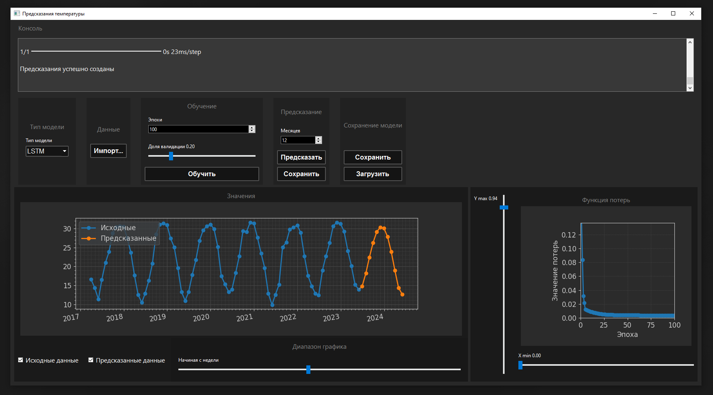

# Проект по предсказыванию температуры по месяцам

## Описание проекта

Проект представляет собой приложение для предсказания температур на основе датасета со средними температурами по месяцам.  
Для создания модели используется Keras.

Модель состоит из:
- Входного слоя с формой (12, 1) — т.е. для предсказания нового значения используются 12 предыдущих
- Основного слоя (LSTM, GRU или SimpleRNN) с активационной функцией relu
- Выходного слоя с одним нейроном

Модель использует функцию потерь mean_squared_error и оптимизатор Adam.

## Запуск

Главный файл программы — `TaskMain.py` в корне проекта

Убедитесь, что установлены все зависимости из `requirements.txt`.

При необходимости доступна видео-демонстрация (ниже)

## Видео-демонстрация

[Видео-демонстрация (YouTube)](https://www.youtube.com/watch?v=0Q2fl09X-TQ)  
[Видео-демонстрация (Google Диск)](https://drive.google.com/file/d/1UwPAudY4WS1WrA7G9A_NhugPSoYVL4Jt/view?usp=sharing)  

### Датасет

В проекте уже скачано несколько файлов датасета.  
Например, можно использовать `open-meteo-26.75N29.77E280m_Egypt.csv` в корне проекта.  

Есть и файл `open-meteo_Egypt.txt` для txt формата.  

Данные скачивались с реальных архивных данных с данного ресурса:  

> https://open-meteo.com/en/docs/historical-weather-api?latitude=55.75&longitude=37.62&start_date=2014-01-01&end_date=2024-01-01

В ссылке уже указаны нужные параметры, но при желании они могут быть изменены. В ссылке (или в интерфейсе на сайте) можно поменять долготу и широту. Для нахождения координат интересующего города можно воспользоваться гугл картами и взять из адресной строки долготу и широту.  

Формат файла имеет температуру по дням, но **программа автоматически преобразует любой файл в датасет по месяцам**, поэтому если вы загрузите датасет, где данные уже разбиты по месяцам, программа примет его так же, как и разбитый по дням.  
Для того чтобы проверить работу программы на данных, действительно представленных по месяцам, используйте файл `lastDatasetFormatted.csv` (и `.txt`), который автоматически создаётся в рабочей директории после импорта каждого датасета. Сам этот файл программой не используется и создаётся только для простоты проверки функционирования с таким форматом.  

## Важные особенности при использовании

### Датасеты .CSV:

Датасет **может быть** хоть набором данных по месяцам, так и по дням, т.е. серьёзных преобразований данных, скачанных с указанного выше ресурса не требуется.  

**Однако:**

Датасет должен начинаться с названий столбцов и **не содержать** в начале доп. информацию. Т.е., при скачивании датасета с указанного ресурса, нужно убрать из файла в начале строки вроде  
> latitude,longitude,elevation,utc_offset_seconds,timezone,timezone_abbreviation  
> 55.755825,37.617298,38.0,0,GMT,GMT  

И оставить только данные формата csv.  

### Датасеты .TXT

Датасет должен быть набором чисел, обозначающих средние температуры за месяц. Вместо дат на графиках по оси X будет использоваться индекс месяца.

### Конвертирование датасетов

Доступна возможность конвертировать скачанный с указанного ресурса собственный .csv датасет в .txt файл (нужно убрать строки в начале). Для этого создан вспомогательный файл приложения `ConvertCsvToTxt.py`, который имеет для этого простейший интерфейс.  

### Сохранение прогнозов

В секции "Предсказание" есть кнопка "Сохранить" (не путайте с одноимённой кнопкой сохранения модели). Эта кнопка даёт сохранить результат в файл `predictions.txt` в рабочей директории.  

### Возможные технические трудности

Первое открытие нативного окна импорта файла часто сопровождается небольшой задержкой, и это связано с инициализацией диалога `PyQt` при первом вызове `QFileDialog.getOpenFileName()` и эта задержка не зависит от дальнейших операций с файлом.  
Также может наблюдаться определённая задержка на первом запуске приложения, и это тоже так или иначе связано с библиотеками и системой.  
  
При любых возможных технических проблемах при проверке решения просьба обратиться к автору.  
